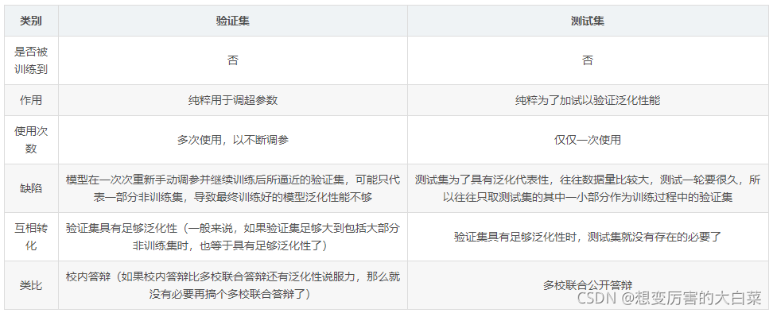

<a id="mulu">目录</a>
<a href="#mulu" class="back">回到目录</a>
<style>
.back{width:40px;height:40px;display:inline-block;line-height:20px;font-size:20px;background-color:lightyellow;position: fixed;bottom:50px;right:50px;z-index:999;border:2px solid pink;opacity:0.3;transition:all 0.3s;color:green;}
.back:hover{color:red;opacity:1}
img{vertical-align:bottom;}
</style>

<!-- @import "[TOC]" {cmd="toc" depthFrom=3 depthTo=6 orderedList=false} -->

<!-- code_chunk_output -->

- [一些基本术语](#一些基本术语)
- [模型评估与选择](#模型评估与选择)
    - [误差与过拟合](#误差与过拟合)
    - [评估方法](#评估方法)

<!-- /code_chunk_output -->

<!-- 打开侧边预览：f1->Markdown Preview Enhanced: open...
只有打开侧边预览时保存才自动更新目录 -->

写在前面：此笔记来自[Vay-keen/Machine-learning-learning-notes](https://github.com/Vay-keen/Machine-learning-learning-notes)

**机器学习**：人的“经验”对应计算机中的“数据”，让计算机来学习这些经验数据，生成一个算法模型，在面对新的情况中，计算机便能作出有效的判断
### 一些基本术语
假设我们收集了一批西瓜的数据，例如：
```
色泽=青绿 根蒂=蜷缩 敲声=浊响
色泽=乌黑 根蒂=稍蜷 敲声=沉闷
色泽=浅自 根蒂=硬挺 敲声=清脆
```
定义：	 
- 所有记录的集合：数据集。
- 每一条记录：**示例(instance)**或**样本(sample)**
- 反映事件或对象在某方面的表现或性质：**属性(attribute)**或**特征(feature)**，例如色泽或敲声
- 属性的取值：**属性值(feature value)**，例如青绿、乌黑
- 属性张成的空间：**属性空间(attribute space)**/**样本空间(sample space)**/**输入空间**
- 如果把属性作为坐标轴，例如把色泽/根蒂/敲声作为三个坐标轴，则它们会张成一个三维空间，每个西瓜都能找到自己的位置，这个点对应着一个坐标向量，因此示例也称**特征向量(feature vector)**
- 样本的特征数：**维数(dimensionality)**，该西瓜的例子维数为3
- 从数据中学得模型：**学习(learning)**/**训练(training)**
- 学习过程中使用的数据：**训练数据(training data)**，其中每个样本为**训练样本(training sample)**，组成的集合为**训练集(training set)**
- 学得的模型对应数据潜在规律，称为**假设(hypothesis)**，这种潜在规律本身称为**真相/真实(ground-truth)**
- 将学习算法在给定数据和参数空间上实例化：**学习器(learner)**
- 示例结果的信息，例如“好瓜”：**标记(label)**，拥有了标记信息的示例称为**样例(example)**，一般用(x~i~, y~i~)表示第i个样例，其中y~i~∈Y是x~i~的样例，Y是所有标记的集合，称为**标记空间(label space)/输出空间**
- **分类(classification)**：预测的是离散值，例如好瓜/坏瓜
  - 如果只涉及两个类别：**二分类(binary classification)**，称其中一个类为**正类(positive class)**，另一个类为**反类(negative class)**
  - 涉及多个类别：**多分类(multi-class classification)**
- **回归(regression)**：预测的是连续值，例如成熟度0.1/0.11/0.2
- 预测任务：通过对训练集学习，建立从输入空间X到输出空间Y的映射。对二分类，常令Y=`{-1, 1}`或`{0, 1}`；对多分类，|Y|>2；对回归任务，Y=R（实数集）
- **测试(testing)**：学得模型后，使用其进行预测。被预测的样本为**测试样本(testing sample)**，设模型为f，测试样本为x，则预测标记y=f(x)
- **聚类(clustering)**：将训练集数据分成若干组，每组为一个**簇(cluster)**，例如浅色瓜/深色瓜，使用的训练样本通常不具有标记信息
- 根据训练数据有无**标记信息**，可将学习任务分为2类：
  - **监督学习(supervised learning)**：有标记，包括分类和回归
  - **无监督学习(unsupervised learning)**：无标记，包括聚类
- **泛化能力(generalization)**：机器学习出来的模型适用于新样本的能力，即从特殊到一般
  通常假设样本空间中全体样本服从一个未知**分布(distribution)**D，我们得到的所有样本都是独立从该分布上采样，即**独立同分布(independent and identically distributed, i.i.d.)**，训练样本越多，模型的泛化能力就有可能越强
- **归纳(induction)**：从特殊到一般的泛化过程，即从具体事实总结出一般规律，例如“从样例中学习”，称为**归纳学习(inductive learning)**
  **演绎(deduction)**：从一般到特殊的**特化(specialization)**过程，即从基本原理推演出具体状况，例如从一组公理推导出相应的定理
- 归纳学习有广义和狭义之分，广义的大致相当于“从样例中学习”，狭义的要求“从训练数据中学得**概念(concept)**”，称为**概念学习/概念形成**，应用较少
- **布尔概念学习**：对“是”/“不是”这样可表示成0/1布尔值的目标概念的学习
- **版本空间(version space)**：与训练集一致的假设集合
- **归纳偏好(inductive bias)/偏好**：机器学习算法在学习过程中对某种类型假设的偏好。对应了“什么样的模型更好”的假设，算法的归纳偏好是否与问题本身匹配，决定算法性能
- **奥卡姆剃刀(Occam's razor)**：若有多个假设与观察一致，则选最简单的那个
- **没有免费的午餐定律(No Free Lunch Theorem, NFL)**：对于一个学习算法A，若它在某些问题上比另一个学习算法B好，则必然存在另一些问题使B比A好
  意义：评判算法好坏，必须针对具体的学习问题
### 模型评估与选择
##### 误差与过拟合
- **错误率(error rate)**：分类错误的样本数占样本总数的比例
- **精度(accuracy)**：1-错误率
- **误差(error)**：学习器对样本的实际预测结果与样本的真实值之间的差异
  - **训练误差(training error)/经验误差(empirical error)**：在训练集上的误差
  - **测试误差(test error)**：在测试集上的误差
  - **泛化误差(generalization error)**：在所有新样本上的误差

  更希望得到泛化误差小的学习器
- **过拟合(overfitting)**：把训练样本自身的一些特点当作了所有潜在样本都会具有的一般性质，导致泛化能力下降
  常见原因：学习能力太强大，以至于把训练样本包含的不太一般的特性到学到了
  特点：训练误差十分小，但测试误差教大；无法彻底避免，只能减小其影响
- **欠拟合(underfitting)**：训练样本的一般性质尚未学好
  常见原因：学习能力低下，较易客服
  训练误差和测试误差都比较大
##### 评估方法
通过**测试集(testing set)**来测试学习器对新样本的判别能力，之后以测试集上的**测试误差(testing error)**作为泛化误差的近似
- 测试集应从样本真实分布中**独立同分布**采样获得，但应尽可能**与训练集互斥**（测试样本不在训练集中，也没在训练中使用）

**训练集与测试集的划分方法**：
- **留出法(hold-out)**：将数据集D划分为两个**互斥**的集合，一个作为训练集S，一个作为测试集T，满足**D=S∪T**
  大约2/3-4/5的样本用作训练，剩下的用作测试，尽可能保持数据分布的一致性，避免分布的差异导致偏差，常见的做法是采取**分层抽样(stratified sampling)**
  由于划分的随机性，单次的留出法结果往往不够稳定，一般要采用若干次随机划分，重复实验取平均值
- **交叉验证法(cross validation)/k折交叉验证(k-fold cross validation)**：将数据集D划分为k个大小相同的互斥子集，满足D=D1∪D2∪...∪Dk，通常也采用分层抽样的方法获得这些子集
  核心思想：每次用**k-1个子集的并集作为训练集，余下的那个子集作为测试集**，共有k种训练集/测试集划分，可进行k次训练和测试，最终返回k次测试结果的均值。k最常用的取值是10，此时称为10折交叉验证
  与留出法类似，将数据集D划分为k个子集的过程具有随机性，因此K折交叉验证通常也要重复p次，称为p次k折交叉验证，常见的是10次10折交叉验证，即进行了100次训练/测试
- **留一法(leave-one-out)**：是特殊的交叉验证——当数据集分成的每个子集只有1个元素时(子集数=样本数)
  评估结果比较准确，但如果数据集很大，计算开销可能难以承受。需要注意的是，因为“没有免费午餐定理”，留一法也未必永远比其他评估方法准确
- **自助采样法(bootstrapping)/有放回采样/可重复采样**：给定包含m个样本的数据集D，每次随机从D中挑选一个样本，将其拷贝放入D'，然后再将该样本放回初始数据集D 中，使得该样本在下次采样时仍有可能被采到。重复执行m 次，就可以得到了包含m个样本的数据集D'。最后D中约有36.8%的样本未出现在D'中，将D'作为训练集，D-D'作为测试集
  **包外估计(out-of-bag estimate)**：实际评估的模型和期望评估的模型都使用m个训练样本，占数据总量1/3的、没在训练集出现的样本用于测试
  在**数据集较小，难以有效划分训练集/测试集**时很有用，但由于自助法产生的数据集（随机抽样）改变了初始数据集的分布，引入了估计偏差。因此在初始数据集足够时，留出法和交叉验证法更加常用

**调参(parameter tuning)**：大多数学习算法都有些**参数(parameter)**需要设定，参数配置不同，学得模型的性能往往有显著差别。在评估和选择模型时，不仅要选择合适的学习算法，还需设定算法参数
- 因为学习算法的很多参数是在实数范围内取值，所以不能对每种参数取值都训练模型。常用的做法：**对每个参数选定一个范围和步长λ**。例如：假定算法有3个参数，在[0, 0.2]范围内以0.05未步长，则每个参数有5个候选值，这样对每一组训练/测试集就有5\*5\*5=125个模型需考察，因此在很多强大的学习算法中，大量参数需要设定，导致极大的调参工程量，而调参好坏对模型性能影响很大

当选定好模型和调参完成后，我们需要**使用初始的数据集重新训练模型**，即让最初划分出来用于评估的测试集也被模型学习，最终模型在训练过程中使用了所有的样本，增强模型的学习效果
- 学得模型在实际使用中的数据：测试集
- 模型评估与选择中用于测试的数据：**验证集(validation set)**
  
总的来说，就是**用测试集估计模型的泛化能力**，而**把训练数据分为训练集和验证集**，基于验证集进行模型选择和调参

---

补充：**验证集和测试集的区别**
- 验证集：调整学习器参数
- 测试集：对已经训练好的分类器进行性能评估

{:width=400 height=400}
