<a id="mulu">目录</a>
<a href="#mulu" class="back">回到目录</a>

<!-- @import "[TOC]" {cmd="toc" depthFrom=3 depthTo=6 orderedList=false} -->

<!-- code_chunk_output -->

- [性能度量](#性能度量)
    - [查准率与查全率](#查准率与查全率)
    - [ROC与AUC](#roc与auc)
    - [代价敏感错误率与代价曲线](#代价敏感错误率与代价曲线)

<!-- /code_chunk_output -->

<!-- 打开侧边预览：f1->Markdown Preview Enhanced: open...
只有打开侧边预览时保存才自动更新目录 -->

写在前面：此笔记来自[Vay-keen/Machine-learning-learning-notes](https://github.com/Vay-keen/Machine-learning-learning-notes)
### 性能度量
**性能度量(performance measure)**：衡量模型泛化能力的评价标准，在对比不同模型的能力时，使用不同的性能度量往往会导致不同的评判结果
> 样例集D={(x~1~, y~1~), (x~2~, y~2~), ..., (x~m~, y~m~)}
> 其中y~i~是示例x~i~的真实标记
> 设学习器为f，则预测结果为f(x)
> 评估学习器性能就是把预测结果f(x)与真实值y进行比较

**均方误差(mean squared error)**：用于回归任务（预测连续值的问题）中
MSE=(预测值-真实值)^2^/样本数
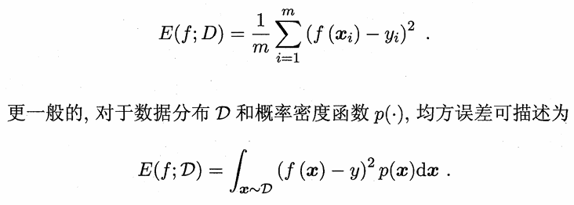{:width=150 height=150}

在分类任务（预测离散值的问题）中，最常用的是错误率和精度：
- 错误率`E(f;D)`：分类错误的样本数占样本总数的比例
  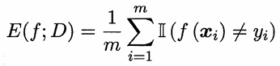{:width=50 height=50}
- 精度`acc(f;D)`：分类正确的样本数占样本总数的比例=1-错误率
  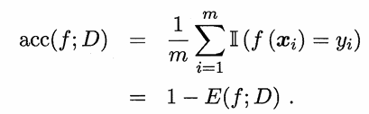{:width=80 height=80}

---

对于二分类问题，可将样例根据其真实类别与学习器预测类别的组合划分为**真正例(true positive)**、**假正例(false positive)**、**真反例(true negative)**、**假反例(false negative)**
- TP+FP+TN+FN=样例总数

分类结果**混淆矩阵(confusion matrix)**：
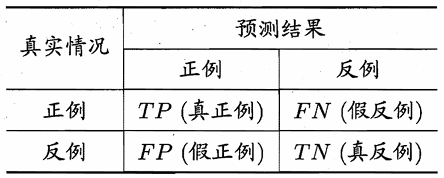{:width=150 height=150}
##### 查准率与查全率
**查准率(precision)**：在预测为正的结果中，有多少真的为正
- **P=TP/(TP+FP)**

**查全率(recall)**：在真的为正的结果中，有多少被预测为正
- **R=TP/(TP+FN)**

查准率和查全率是一对矛盾的度量，一个高时往往另一个偏低。例如想把查准率提高，就要尽可能选可能性最高的预测为正，这就必然导致有更多真实为正的的结果没被预测为正（查全率偏低）；想把查全率提高，就要降低标准，尽可能多地预测为正，导致查准率偏低
**查准率-查全率曲线（P-R曲线）**：以查准率为纵轴、查全率为横轴。根据学习器的预测结果对样例进行排序，将学习器认为"最可能"是正例的样本排在前面，按此顺序逐个把样本作为正例进行预测，每次统计当前的查全率、查准率
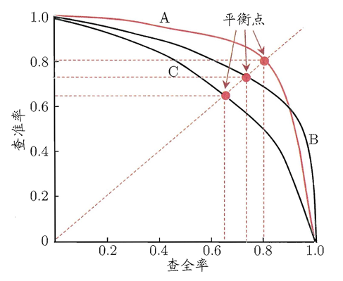{:width=300 height=300}
- 若一个学习器A的P-R曲线被另一个学习器B的P-R曲线完全包住，则B的性能优于A
- 若A和B的曲线发生了交叉，则谁的曲线下的面积大，谁的性能更优，但这一值是很难进行估算的
  - **平衡点(Break-Event Point, BEP)**：当查准率=查全率时的取值，平衡点的取值越高，性能更优
  - **F1度量**：更加常用
  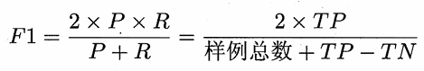{:width=70 height=70}
  - 如果对查准率和查全率的重视程度不同，就可使用F1度量的一般形式Fβ，设置对查准率/查全率的不同偏好
  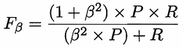{:width=60 height=60}
  β表示查全率对查准率的相对重要性，>1则查全率影响更大，反之则查准率影响更大
  
---

如果有多个二分类混淆矩阵，例如多次训练/在多个数据集上训练/多分类任务中两两类别的组合。此时估算全局性能的方法有两种：
- **宏观(macro)**：先算出每个混淆矩阵的P值和R值，然后取得平均P值macro-P和平均R值macro-R，再算出Fβ或F1
- **微观(micro)**：先算出混淆矩阵的平均TP、FP、TN、FN，接着进行计算P、R，进而求出Fβ或F1

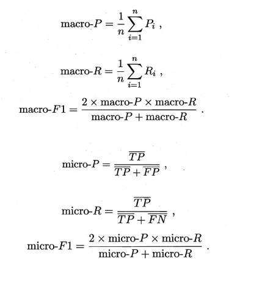{:width=400 height=400}
##### ROC与AUC
很多学习器是为测试样本产生一个实值或概率预测，然后将这个预测值与一个**阈值(threshold)**进行比较，若大于阈值则分为正类，否则为反类。根据这个实值或概率预测结果将测试样本进行排序，“最可能”是正的排在最前面，“最不可能”是正例的排在最后面，此时分类过程就相当于在这个排序中以某个**截断点(cut point)**将样本分为两部分，前一部分判作正例，后一部分则判作反例
- 可根据任务需求来采用不同的截断点，如果更重视查准率，就在排序中靠前的位置进行截断，如果更重视查全率，就在排序中靠后的位置进行截断

**受试者工作特征曲线(Receiver Operating Characteristic, ROC)**：与PR曲线类似，只是它的纵轴是**假正例率(False Positive Rate, FPR)**，横轴是**真正例率(True Positive Rate, TPR)**，偏重研究基于测试样本评估值的排序好坏
- TPR=TP/(TP+FN)
- FPR=FP/(TN+FP)

**性能评估**：
- 若一个学习器A的ROC曲线被另一个学习器B的ROC曲线完全包住，则称B的性能优于A
- 若A和B的曲线发生了交叉，则比较**ROC曲线下的面积(Area Under ROC Curve, AUC)**，越大则性能更优
  假设ROC曲线是由坐标为{(x~1~, y~1~), ... ,(x~m~, y~m~)}的点按序连接而形成
  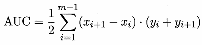{:width=60 height=60}

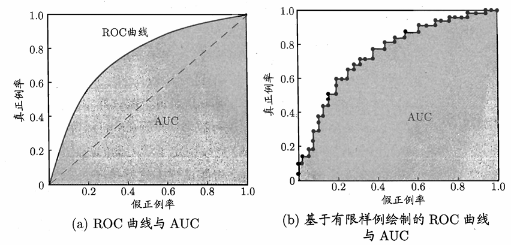{:width=300 height=300}
- 对角线：“随机猜测”模型
- (0,1)点：“理想模型”（正例全部出现在负例之前），AUC=1
- (1,0)点：最差情况（负例全部出现在正例之前），AUC=0
- (0,0)点：将所有的样本预测为负例
- (1,1)点：将所有的样本预测为正例

现实中的任务通常都是有限个测试样本，因此只能绘制出近似ROC曲线
- 给定m+个正例和m-个反例，根据学习器预测结果对样例进行排序，然后把分类阔值设为最大（即把所有样例均预测为反例），此时真正例率和假正例率均为0，在坐标(0，0)处
- 将分类阐值依次设为每个样例的预测值（即依次将每个样例划分为正例）
  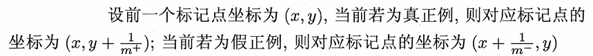{:width=50 height=50}

AUC主要考虑的是样本预测的排序质量，**排序“损失” (loss)**：考虑每一对正、反例，若正例的预测值小于反例，则记一个“罚分”，若相当，则记1/2个罚分，对应的是ROC曲线之上的面积，值为1-AUC
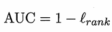{:width=50 height=50}
##### 代价敏感错误率与代价曲线

上面的方法中，将学习器的犯错同等对待，但在现实生活中，将正例预测成假例与将假例预测成正例的代价常常是不一样的，例如：将无疾病-->有疾病只是增多了检查，但有疾病-->无疾病却是增加了生命危险。以二分类为例，由此引入了“代价矩阵”（cost matrix）。

在非均等错误代价下，我们希望的是最小化“总体代价”，这样“代价敏感”的错误率（2.5.1节介绍）为：

同样对于ROC曲线，在非均等错误代价下，演变成了“代价曲线”，代价曲线横轴是取值在[0,1]之间的正例概率代价，式中p表示正例的概率，纵轴是取值为[0,1]的归一化代价。

代价曲线的绘制很简单：设ROC曲线上一点的坐标为(TPR，FPR) ，则可相应计算出FNR，然后在代价平面上绘制一条从(0，FPR) 到(1，FNR) 的线段，线段下的面积即表示了该条件下的期望总体代价；如此将ROC 曲线土的每个点转化为代价平面上的一条线段，然后取所有线段的下界，围成的面积即为在所有条件下学习器的期望总体代价，如图所示：

在此模型的性能度量方法就介绍完了，以前一直以为均方误差和精准度就可以了，现在才发现天空如此广阔~