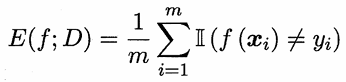
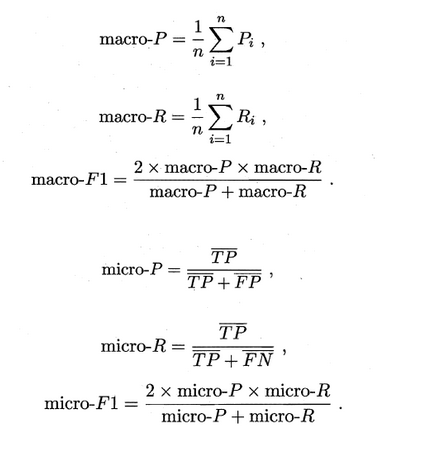
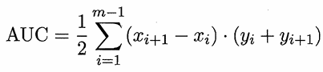
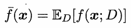

<a id="mulu">目录</a>
<a href="#mulu" class="back">回到目录</a>

<!-- @import "[TOC]" {cmd="toc" depthFrom=3 depthTo=6 orderedList=false} -->

<!-- code_chunk_output -->

- [性能度量](#性能度量)
    - [查准率与查全率](#查准率与查全率)
    - [ROC与AUC](#roc与auc)
    - [代价敏感错误率与代价曲线](#代价敏感错误率与代价曲线)
- [比较检验](#比较检验)
- [偏差与方差](#偏差与方差)

<!-- /code_chunk_output -->

<!-- 打开侧边预览：f1->Markdown Preview Enhanced: open...
只有打开侧边预览时保存才自动更新目录 -->

写在前面：此笔记来自[Vay-keen/Machine-learning-learning-notes](https://github.com/Vay-keen/Machine-learning-learning-notes)
### 性能度量
**性能度量(performance measure)**：衡量模型泛化能力的评价标准，在对比不同模型的能力时，使用不同的性能度量往往会导致不同的评判结果
> 样例集D={(x~1~, y~1~), (x~2~, y~2~), ..., (x~m~, y~m~)}
> 其中y~i~是示例x~i~的真实标记
> 设学习器为f，则预测结果为f(x)
> 评估学习器性能就是把预测结果f(x)与真实值y进行比较

**均方误差(mean squared error)**：用于回归任务（预测连续值的问题）中
MSE=(预测值-真实值)^2^/样本数
{:width=150 height=150}

在分类任务（预测离散值的问题）中，最常用的是错误率和精度：
- 错误率`E(f;D)`：分类错误的样本数占样本总数的比例
  {:width=50 height=50}
- 精度`acc(f;D)`：分类正确的样本数占样本总数的比例=1-错误率
  {:width=80 height=80}

---

对于二分类问题，可将样例根据其真实类别与学习器预测类别的组合划分为**真正例(true positive)**、**假正例(false positive)**、**真反例(true negative)**、**假反例(false negative)**
- TP+FP+TN+FN=样例总数

分类结果**混淆矩阵(confusion matrix)**：
{:width=150 height=150}
##### 查准率与查全率
**查准率(precision)**：在预测为正的结果中，有多少真的为正
- **P=TP/(TP+FP)**

**查全率(recall)**：在真的为正的结果中，有多少被预测为正
- **R=TP/(TP+FN)**

查准率和查全率是一对矛盾的度量，一个高时往往另一个偏低。例如想把查准率提高，就要尽可能选可能性最高的预测为正，这就必然导致有更多真实为正的的结果没被预测为正（查全率偏低）；想把查全率提高，就要降低标准，尽可能多地预测为正，导致查准率偏低
**查准率-查全率曲线（P-R曲线）**：以查准率为纵轴、查全率为横轴。根据学习器的预测结果对样例进行排序，将学习器认为"最可能"是正例的样本排在前面，按此顺序逐个把样本作为正例进行预测，每次统计当前的查全率、查准率
{:width=300 height=300}
- 若一个学习器A的P-R曲线被另一个学习器B的P-R曲线完全包住，则B的性能优于A
- 若A和B的曲线发生了交叉，则谁的曲线下的面积大，谁的性能更优，但这一值是很难进行估算的
  - **平衡点(Break-Event Point, BEP)**：当查准率=查全率时的取值，平衡点的取值越高，性能更优
  - **F1度量**：更加常用
  {:width=70 height=70}
  - 如果对查准率和查全率的重视程度不同，就可使用F1度量的一般形式Fβ，设置对查准率/查全率的不同偏好
  {:width=60 height=60}
  β表示查全率对查准率的相对重要性，>1则查全率影响更大，反之则查准率影响更大
  
---

如果有多个二分类混淆矩阵，例如多次训练/在多个数据集上训练/多分类任务中两两类别的组合。此时估算全局性能的方法有两种：
- **宏观(macro)**：先算出每个混淆矩阵的P值和R值，然后取得平均P值macro-P和平均R值macro-R，再算出Fβ或F1
- **微观(micro)**：先算出混淆矩阵的平均TP、FP、TN、FN，接着进行计算P、R，进而求出Fβ或F1

{:width=400 height=400}
##### ROC与AUC
很多学习器是为测试样本产生一个实值或概率预测，然后将这个预测值与一个**阈值(threshold)**进行比较，若大于阈值则分为正类，否则为反类。根据这个实值或概率预测结果将测试样本进行排序，“最可能”是正的排在最前面，“最不可能”是正例的排在最后面，此时分类过程就相当于在这个排序中以某个**截断点(cut point)**将样本分为两部分，前一部分判作正例，后一部分则判作反例
- 可根据任务需求来采用不同的截断点，如果更重视查准率，就在排序中靠前的位置进行截断，如果更重视查全率，就在排序中靠后的位置进行截断

**受试者工作特征曲线(Receiver Operating Characteristic, ROC)**：与PR曲线类似，只是它的纵轴是**假正例率(False Positive Rate, FPR)**，横轴是**真正例率(True Positive Rate, TPR)**，偏重研究基于测试样本评估值的排序好坏
- TPR=TP/(TP+FN)
- FPR=FP/(TN+FP)

**性能评估**：
- 若一个学习器A的ROC曲线被另一个学习器B的ROC曲线完全包住，则称B的性能优于A
- 若A和B的曲线发生了交叉，则比较**ROC曲线下的面积(Area Under ROC Curve, AUC)**，越大则性能更优
  假设ROC曲线是由坐标为{(x~1~, y~1~), ... ,(x~m~, y~m~)}的点按序连接而形成
  {:width=60 height=60}

{:width=300 height=300}
- 对角线：“随机猜测”模型
- (0,1)点：“理想模型”（正例全部出现在负例之前），AUC=1
- (1,0)点：最差情况（负例全部出现在正例之前），AUC=0
- (0,0)点：将所有的样本预测为负例
- (1,1)点：将所有的样本预测为正例

现实中的任务通常都是有限个测试样本，因此只能绘制出近似ROC曲线
- 给定m+个正例和m-个反例，根据学习器预测结果对样例进行排序，然后把分类阔值设为最大（即把所有样例均预测为反例），此时真正例率和假正例率均为0，在坐标(0，0)处
- 将分类阐值依次设为每个样例的预测值（即依次将每个样例划分为正例）
  {:width=50 height=50}

AUC主要考虑的是样本预测的排序质量，**排序“损失” (loss)**：考虑每一对正、反例，若正例的预测值小于反例，则记一个“罚分”，若相当，则记1/2个罚分，对应的是ROC曲线之上的面积，值为1-AUC
{:width=50 height=50}
##### 代价敏感错误率与代价曲线
将正例预测成假例与将假例预测成正例的代价常常是不一样的，为权衡不同类型错误所造成的不同损失，可为错误赋予**非均等代价(unequal cost)**
在二分类任务中，可设定一个**代价矩阵(cost matrix)**，其中cost~ij~表示将第i类样本预测为第j类样本的代价
{:width=150 height=150}
- 损失程度相差越大， cost~01~与cost~10~值的差别越大.

在非均等错误代价下，我们希望的是最小化**总体代价(total cost)**，这样**代价敏感(cost-sensitive)**的错误率为：
{:width=80 height=80}
在非均等错误代价下，演变成了“代价曲线”，代价曲线横轴是**正例概率代价P(+)cost**，纵轴是**归一化代价cost~norm~**
{:width=120 height=120}
- p表示正例的概率
- 横轴纵轴取值都在`[0,1]`之间

ROC曲线上每一点对应了代价平面上的一条线段，设ROC曲线上一点的坐标为`(TPR,FPR)`，则计算出FNR，然后在代价平面上绘制一条从`(0,FPR)`到`(1,FNR)`的线段，线段下的面积即表示了该条件下的期望总体代价；如此将ROC曲线土的每个点转化为代价平面上的一条线段，然后取所有线段的下界，围成的面积即为在所有条件下学习器的**期望总体代价**
{:width=250 height=250}
### 比较检验
> 这里我们以“错误率”作为性能度量的标准

**假设**：对样本总体的分布或已知分布中某个参数值的一种猜想，具体来说，是对学习器泛化错误率分布的某种判断或猜想。例如：假设总体服从泊松分布，或假设正态总体的期望u=u0
**假设检验**：在测量学习器的泛化错误率时，我们只能通过测试集获得测试错误率，但直观上测试错误率和泛化错误率相差不会太远，因此可以通过测试错误率来推测泛化错误率的分布

适用于对**单个学习器**泛化性能的检验方法：
- **二项检验(binomial test)**：在α的显著度下，假设`ε≤ε0`不能被拒绝，即能以`1-α`的置信度认为，学习器的泛化错误率不大于ε0；否则该假设可被拒绝，即在α的显著度下可认为学习器的泛化错误率大于ε0
- **t检验(t-test)**：用于通过多次重复留出法或交叉验证法等进行多次训练/测试，从而得到多个测试误率的情况
    {:width=250 height=250}
    临界值：对假设`μ=ε0`和显著度α，当测试错误率均值为ε0时，在`1-α`概率内能观测到的最大错误率
    双边假设(two-tailed)：两边阴影部分各有α/2的面积，若平均错误率μ与ε0之差`|μ-ε0|`位于临界值范围[t~-α/2~, t~α/2~]内，则不能拒绝假设`μ=ε0`"，即可认为泛化错误率为ε0，置信度为1-α; 否则可拒绝该假设，即在该显著度下可认为泛化错误率与ε0有显著不同
    α常用取值有0.05和0.1

---

适用于对**多个学习器**泛化性能的检验方法：
- **k折交叉验证成对t检验(paired t-tests)**：若两个学习器的性能相同，则它们使用相同的训练/测试集得到的测试错误率应相同
  - 先对每对结果求差，根据差值对"学习器A与B性能相同"这个假设做t检验，计算出差值的均值μ和方差σ^2^，在显著度α下，若变量{:width=50 height=50}小于临界值t~α/2,k-1~，则假设不能被拒绝，即认为两个学习器的性能没有显著差别；否则认为有差别，且平均错误率较小的那个学习器性能较优
  - 5x2交叉验证：在每次2折交叉验证之前随机将数据打乱，使得5次交叉验证中的数据划分不重复。第i次2折交叉验证产生两对测试错误率，分别求差，得到第1折上的差值Δ^1^~i~和第2折的Δ^2^~i~；计算第1次2折交叉验证的两个结果的平均值μ=0.5(Δ^1^~i~+Δ^2^~i~)；对每次2折实验的结果都计算方差{:width=50 height=30}。变量{:width=60 height=60}服从自由度为5的t分布，双边检验临界值为t~α/2,5~
- **McNemar检验**：在二分类问题中，可得到两学习器分类结果的差别，如**列联表(contingency table)**
  {:width=150 height=150}
  假设是两学习器性能相同，则应有e~01~=e~10~，那么变量|e~01~-e~10~|应当服从正态分布，且均值为1，方差为e~01~+e~10~。变量{:width=50 height=50}服从自由度为1的χ^2^分布（卡方分布），给定显著度α，当以上变量恒小于临界值χ^2^~α~时，不能拒绝假设，即认为两学习器的性能没有显著差别；否则认为有差别，且平均错误率较小的那个学习器性能较优
- Friedman检验与Nemenyi后续检验：对多个算法进行比较，前面的方法只能两两比较，而该方法基于算法排序
  - Friedman检验使用留出法或交叉验证法得到每个算法在每个数据集上的测试结果，然后在每个数据集上根据测试性能由好到坏排序，并赋予序值1, 2, ...，若算法的测试性能相同，则平分序值
    {:width=150 height=150}
    使用Friedman检验来判断这些算法是否性能都相同：若相同，则它们的平均序值应当相同。一次使用卡方检验和F检验，判断“所有算法的性能相同”这个假设是否成立，若不成立，则需进行**后续检验(post-hoc test)**进一步区分各算法
  - **Nemenyi后续检验**：计算出平均序值差别的临界值域CD，若两个算法的平均序值之差超出了CD， 则以相应的置信度拒绝“两个算法性能相同”这一假设，两两判断算法的性能有无区别
  - **Friedman检验图**：纵轴显示各个算法，横轴是平均序值，圆点显示算法的平均序值，以圆点为中心的横线段表示临界值域的大小。若两个算法的横线段有交叠，则说明这两个算法没有显著差别，否则即说明有显著差别
    {:width=150 height=150}
    如图，算法A与B没有显著差别（横线段有交叠区域），而算法A显著优于算法C（没有交叠区域）
### 偏差与方差
**偏差-方差分解(bias-variance decomposition)**：对学习算法的期望泛化错误率进行拆解，解释学习器的泛化性能
- **偏差(bias)**：期望输出与真实标记的差别，度量了学习算法的期望预测与真实结果的偏离程度，刻画了**学习算法本身的拟合能力**
- **方差(variance)**：度量了同样大小的训练集的变动所导致的学习性能的变化，刻画了**数据扰动所造成的影响**
- **噪声**：表达了在当前任务上任何学习算法所能达到的期望泛化误差的下界，刻画了**学习问题本身的难度**

对测试样本x，y~D~为x在数据集中的标记，y为x的真实标记，f(x;D)为训练集D中模型f在x上的预测输出
- 期望预测{:width=36 height=36}
- 方差{:width=35 height=38}
- 噪声{:width=35 height=35}
- 偏差{:width=30 height=30}
- 假定噪声期望为0(E~D~[y~D~-y]=0)，期望泛化误差{:width=30 height=30}
  即期望泛化误差可分解为偏差、方差与噪声之和

总的来说，泛化性能是由**学习算法的能力**、**数据的充分性**以及**学习任务本身的难度**所共同决定的。为了取得好的泛化性能，需使偏差较小，即能够充分拟合数据；并且使方差较小，即使得数据扰动产生的影响小
- 偏差刻画学习器的拟合能力
- 方差体现学习器的稳定性
- 期望泛化误差=方差+偏差+噪声

---

**偏差-方差窘境(bias-variance dilamma)**：偏差与方差是有冲突的。
- **训练程度不足**，学习器的拟合能力不够强，训练数据的扰动不足以便学习器产生显著变化，此时**偏差主导了泛化错误率**
- **训练程度加深**，学习器的拟合能力逐渐增强，训练数据发生的扰动渐渐能被学习器学到，**方差逐渐主导了泛化错误率**
- **训练程度充足**，学习器的拟合能力已非常强，训练数据发生的**轻微扰动都会导致学习器发生显著变化**
  若训练数据**自身的、非全局的特性被学习器学到了**，则将发生**过拟合**

{:width=300 height=300}
总的来说，在欠拟合时，偏差主导泛化误差；而训练到一定程度后，偏差越来越小，方差主导了泛化误差
